# 🎙️ AI-Podcast

<!-- You can add a badge here later, e.g., license or build status -->
[](https://github.com/modelscope/agentscope)
[]()

**AI-Podcast** is an intelligent audio content generation platform powered by Multi-Agent collaboration. It transforms topics, documents, or URLs into immersive, podcast-style audio conversations. By leveraging state-of-the-art LLMs and TTS models, it orchestrates a team of AI agents—from planners to directors and voice actors—to produce high-quality, structured, and engaging audio content in real-time.

---

## ✨ Key Features

*   **👥 Flexible Cast Formats**: Supports **Solo** (Monologue), **Duo** (Dialogue), and **Multi-person** (Roundtable) modes to suit different content styles.
*   **🧠 Adaptive Depth Modes**:
    *   **Lite Mode**: Quick, concise summaries for rapid consumption.
    *   **Deep Exploration Mode**: In-depth analysis where agents perform parallel web searches and structured outlining for comprehensive coverage.
*   **🎭 Custom Personas & Voices**: Users can fully customize character personalities (system prompts) and timbre (voice cloning/selection).
*   **🗣️ Real-time Interaction**: Supports user intervention, allowing you to join the discussion and steer the conversation in real-time.
*   **📚 Diverse Inputs**: Generate podcasts from a simple **Topic**, uploaded **Documents** (PDF/Txt), or **URLs**.

---

## 🛠️ Tech Stack

This project is built upon a robust stack of cutting-edge open-source tools:

*   **Multi-Agent Framework**: [AgentScope](https://github.com/modelscope/agentscope) - Orchestrates the complex interaction between agents.
*   **Large Language Models (LLM)**:
    *   `Qwen/Qwen3-8B`
    *   `tencent/Hunyuan-7B-Instruct`
*   **Text-to-Speech (TTS)**:
    *   `FunAudioLLM/CosyVoice2-0.5B` - Provides natural, emotional, and streaming speech synthesis.

---

## 🏗️ Architecture

### Deep Exploration Mode Workflow

In the **Deep Exploration Mode**, the system employs a sophisticated chain of agents to ensure the content is factual, structured, and engaging.

```mermaid
graph TD
    %% Nodes
    User([👤 User Input])
    Planner[🧠 Planner Agent]
    SubPlanner[🔎 Sub Planner Agents]
    Outline[📝 Podcast Outline]
    Director[🎬 Director Agent]
    Roles[🗣️ Role Agents]
    ScreenWriter[✍️ ScreenWriter Agent]
    TTS[🌊 TTS Engine]
    Audio([🔊 Streamed Audio])
    Summary[📉 Summary Agent]
    Memory[(💾 Global Memory)]

    %% Flow
    User -->|Topic / Doc / URL| Planner
    Planner -->|Identify Intent & Distribute Tasks| SubPlanner
    
    subgraph Exploration [Parallel Exploration Phase]
        SubPlanner -->|Web Search & Research| SubPlanner
    end

    SubPlanner -->|Finalize Structure| Outline
    
    subgraph Production [Chapter Loop Production]
        Outline -->|Iterate Chapters| Director
        Director -->|Set Emotion & Direction| Roles
        Roles -->|Broadcast Information| Roles
        Roles -->|Raw Dialogue| ScreenWriter
        ScreenWriter -->|Polish & Format| TTS
        TTS -.->|Real-time Stream| Audio
    end

    %% Memory & Loop
    ScreenWriter --> Summary
    Summary -->|Update Context| Memory
    Memory -.->|Context Feedback| Director
    Memory -.->|Context Feedback| Roles
```



### Workflow Description
1.  **Planner Agent**: Analyzes user intent and creates a high-level directive.
2.  **Sub Planner Agents**: Execute parallel tasks (including Web Search) to gather information and draft a detailed **Podcast Outline**.
3.  **Director Agent**: For each chapter, sets the emotional tone and guides the conversation flow.
4.  **Role Agents**: Adopt specific personas and generate dialogue using an **Information Broadcast** mechanism to share knowledge.
5.  **ScreenWriter Agent**: Aggregates the dialogue, polishes the script for natural flow, and hands it off to TTS.
6.  **TTS Engine**: Converts the script into audio via streaming for low latency.
7.  **Summary Agent & Memory**: Maintains the context of the conversation to ensure consistency across chapters.

---

## 🚀 Roadmap & Todo

- [x] **Core Framework**: Setup AgentScope environment.
- [x] **Cast Modes**: Support for Single, Dual, and Multi-agent conversations.
- [x] **Customization**: Support for user-defined personas and specific voice timbres.
- [ ] **Deep Exploration Mode**: Integrate Sub-Planner parallel search and outline generation (*Pending Merge*).
- [ ] **Input Handling**: 
    - [x] User Topic Input
    - [ ] Document (PDF/Text) Parsing (*Pending Merge*)
    - [ ] URL Content Extraction (*Pending Merge*)
- [ ] **Real-time Interaction**: Enable users to interrupt and participate in the chat (*Pending Merge*).

---

## 📥 Getting Started

### Prerequisites
*   Python 3.9+
*   CUDA-compatible GPU (for local LLM/TTS inference)

### Installation

1.  **Clone the repository**
    ```bash
    git clone https://github.com//h2h2h/multi_agents_podcast.git
    cd multi_agents_podcast
    ```

2.  **Install dependencies**
    ```bash
    pip install -r requirements.txt
    ```

3.  **Model Setup**
    *   Download `CosyVoice2-0.5B` and place it in the `models/tts` directory.
    *   Configure your LLM endpoints (or local paths for Qwen/Hunyuan) in `config.yaml`.

### Usage
**Todo**


---

## 🤝 Contributing

Contributions are welcome! Please feel free to submit a Pull Request.

## 📄 License

This project is licensed under the MIT License.
